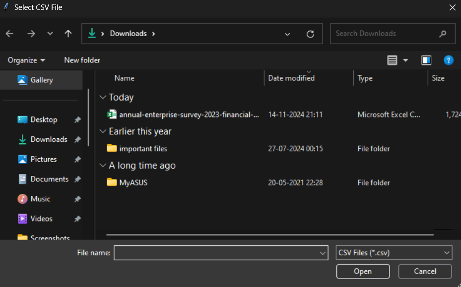

# Quiz-App

Description:

1.  Import Libraries:

pandas as pd: Used for reading the CSV file and writing the Excel file.

from tkinter import Tk, filedialog, messagebox: Used to create a file dialog for selecting the CSV file and displaying messages.

2. Define Function (csv_to_excel):

Open File Dialog: filedialog.askopenfilename() opens a dialog to select a CSV file. If no file is selected, a warning message is displayed.

Read CSV File: pd.read_csv(csv_file_path) reads the selected CSV file into a DataFrame.

Set Output Path: The output file path is set to the same name as the CSV file but with a .xlsx extension.

Write to Excel: df.to_excel(excel_file_path, index=False) writes the DataFrame to an Excel file without including the DataFrame index.

Success Message: A success message box is displayed if the file is converted and saved successfully.

Error Handling: An error message box is displayed if any exception occurs during the conversion.

3.  Tkinter Window:

root = Tk(): Creates the main Tkinter window.

root.withdraw(): Hides the main window as only file dialogs and message boxes are needed.

4.  Call Conversion Function:

csv_to_excel(): Calls the function to perform the CSV to Excel conversion.

5.  Close Tkinter Window:

root.destroy(): Closes the Tkinter window after the process is complete.